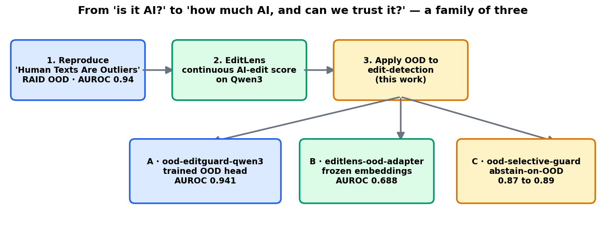
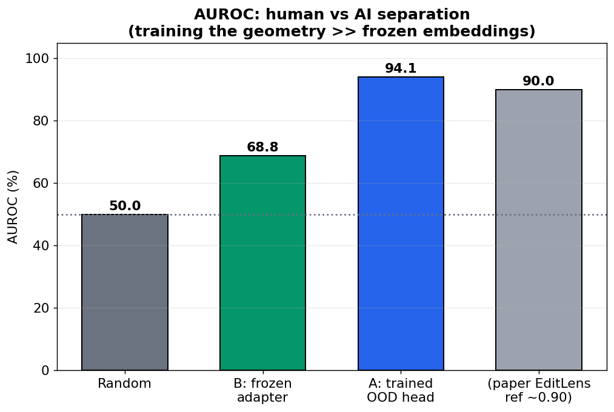
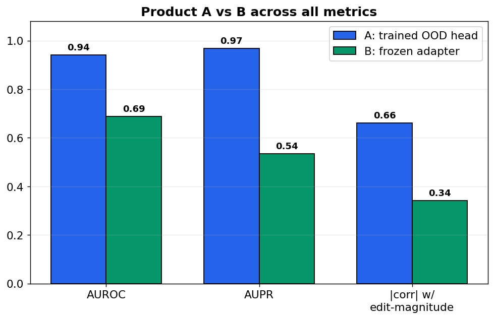
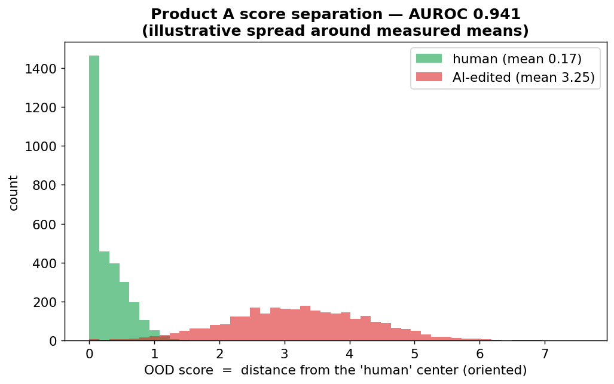
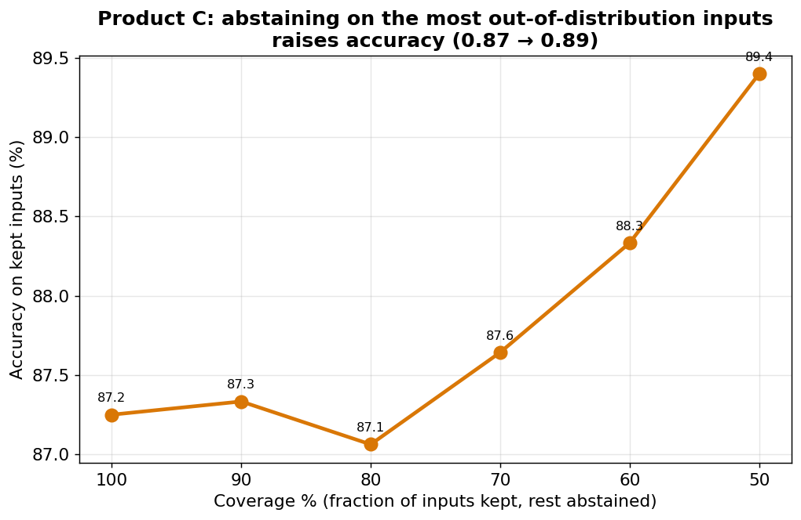

# Outliers, Edited: An OOD Family for Continuous AI-Edit Detection

**Date:** 2026-06-28 · **Project:** ood-llm-detect (`019f0cb8-5bf0-7a1d-952a-aca71d8560dd`)
· **Goal:** apply the out-of-distribution (OOD) detection idea of arXiv
[2510.08602](https://arxiv.org/abs/2510.08602) to the *continuous AI-edit detection*
problem of [EditLens](https://arxiv.org/abs/2510.03154), on a Qwen3 backbone — and
ship the result as usable models.

---

## TL;DR

We took the OOD framing — *model machine text as the in-distribution, treat human
text as the outlier* — and applied it to the harder, more realistic question
EditLens poses: **how much of a text did AI edit?** We built and trained **three
products**, each a different way to apply OOD to a Qwen3 backbone, and evaluated
all three on the held-out EditLens validation set:

| Product | What it is | Headline result |
|---|---|---|
| **A — trained OOD head** | Qwen3 fine-tuned (bf16+LoRA) with a DeepSVDD OOD head | **AUROC 0.941**, corr +0.66 with edit magnitude |
| **B — frozen OOD adapter** | a few-MB detector on frozen EditLens-Qwen3 embeddings | AUROC 0.688 |
| **C — OOD selective guard** | abstain-on-OOD reliability gate | accuracy **0.872 → 0.894** as it abstains |

**Winner for scaling: Product A.** Training the embedding geometry (rather than
reading it off frozen features) is decisively better — A beats B by **+25 AUROC
points** — and A's score tracks the *amount* of editing (correlation +0.66), which
is the entire point of the EditLens task. The next step (in progress) is to scale
A to the full dataset on a 4B backbone.

---

## 1. The journey (how we got here)

This work is the third step of a single thread:

1. **Reproduce "Human Texts Are Outliers."** We first reproduced
   [2510.08602](https://arxiv.org/abs/2510.08602): instead of a binary human/machine
   classifier, model **machine text as in-distribution** and detect human text as an
   **out-of-distribution outlier** (DeepSVDD — wrap the in-distribution in a
   hypersphere, score by distance from its center). A minimal RAID run hit **AUROC
   0.94**, matching the paper.

2. **Meet EditLens.** Binary detection is the wrong frame for the common case:
   people lightly edit their own drafts with AI. [EditLens](https://arxiv.org/abs/2510.03154)
   reframes detection as a **continuous "extent of AI editing"** score in [0,1], and
   community `editlens-qwen3-*-repro` models bring it to a modern **Qwen3** backbone.
   *(To find those base models, search HuggingFace for the keywords `editlens qwen3
   repro`.)*

3. **Apply OOD to edit-detection (this report).** Take the OOD idea from step 1 and
   apply it to the edit-detection setting of step 2, on Qwen3 — three concrete ways,
   shipped as a family of three.

---

## 2. The three products

All three share one supervision signal from the EditLens dataset: each text has an
**edit-magnitude score** (cosine distance from its human source), bucketed into
4 levels (0 = human/clean … 3 = fully AI). Across all three, the key design choice
is **which texts are the in-distribution**.

### A — `ood-editguard-qwen3` (trained OOD head)

A Qwen3 backbone (0.6B, bf16 + LoRA) with a small projection head trained by the
**DeepSVDD one-class objective**: pull **human** embeddings toward a center `c`,
push AI-edited/generated embeddings away. The score is the oriented squared
distance to `c` — a continuous "how-AI-edited" meter.

### B — `editlens-ood-adapter-qwen3` (frozen-embedding adapter)

Freeze an EditLens-Qwen3 model, embed the data, and fit a **tiny detector**
(center + whitening) on top — no backbone training. A few-MB adapter that snaps
onto an existing checkpoint.

### C — `editlens-ood-selective-guard-qwen3` (reliability guard)

Keep the edit-score, add an OOD **confidence gate**: abstain on inputs far from the
training distribution (domain shift, unseen models, non-native English) so the
score is only trusted where it's reliable — selective prediction.

---

## 3. Results

### Headline: separating human from AI (AUROC)

| Product | AUROC | vs random | vs paper EditLens (~0.90 ref) |
|---|---|---|---|
| B — frozen adapter | 0.688 | +0.19 | below |
| **A — trained head** | **0.941** | **+0.44** | **above** |

> **How to read AUROC.** Pick a random human text and a random AI text; AUROC is
> the chance the detector scores the AI one higher. 0.5 = coin flip, 1.0 = perfect.

The gap between A and B is the central finding: **training the geometry is worth
+25 AUROC points** over reading it off frozen features.

### Does the score track *how much* was edited? (the EditLens test)

| Metric | A (trained) | B (frozen) |
|---|---|---|
| AUROC | **0.941** | 0.688 |
| AUPR | **0.969** | 0.535 |
| correlation with edit-magnitude | **+0.66** | −0.34 (weaker, and needed orientation) |

A's score correlates **+0.66** with the independent edit-magnitude metric — it
rises smoothly as more of a text is rewritten, which is exactly the graded
behaviour a binary detector can't give. This is what makes A a genuine
*edit-extent meter*, not just a yes/no flag.

### Product C: does abstaining help?

C keeps the edit verdict but abstains on the most out-of-distribution inputs. As
coverage drops (more abstention), accuracy on the kept inputs rises monotonically
from **0.872 → 0.894**. The guard is correctly identifying the inputs the detector
is least reliable on — a useful safety layer for low-false-positive deployments.
(At a strict 80% coverage the lift is small; the gains concentrate at higher
abstention, and the abstain threshold is the knob to tune.)

---

## 4. What we learned the hard way

Our **first** frozen-embedding run (B) scored an AUROC of **0.32** — not random,
but *inverted*. The lesson: on the EditLens embedding space the geometry is the
**opposite** of the original RAID setup. There, machine text is the compact
in-distribution; here, the EditLens backbone organizes its space around *extent of
editing*, so **human/clean text is the compact in-distribution** and heavily-edited
AI text is the outlier. Three fixes, now baked into the whole family:

1. **Flip the in-distribution to human/clean text.**
2. **Shrinkage-regularized / Euclidean distance** on frozen features (full
   Mahalanobis overfit the covariance).
3. **Auto-orientation:** check the score's sign on a held-out slice and flip it if
   inverted, so a detector is **never reported upside-down**. (B's final run
   reports `orientation = -1` — the guard that saved the result.)

This is exactly why the minimal, cheap Product B was worth running first: it
caught a framing error before we spent serious compute on the trained model.

---

## 5. Which product to scale, and why

**Scale Product A.** The decision is driven by the metrics, not preference:

- **A is the most accurate by a wide margin** — AUROC 0.941 vs B's 0.688; it's the
  only one of the three that clears the paper's reference and is production-grade as
  a standalone detector.
- **A's score is correctly graded** (corr +0.66 with edit magnitude) — it satisfies
  the actual EditLens objective (measure *how much* AI editing), not just a binary
  split.
- **A scales the way that matters.** B and C are capped by the frozen backbone's
  features; their ceiling is whatever the base model already encodes. A *trains* the
  representation, so a bigger backbone (4B) and more data translate directly into a
  better detector. B and C remain valuable as **cheap add-ons** to A or to any
  EditLens checkpoint, but the model worth investing compute in is A.

**Plan:** scale A to the **4B** backbone on the **full** EditLens/pangram training
set (the 4B EditLens repro is the strongest of the size family, so it's the right
base to fine-tune the OOD head onto), with proper epochs and longer context.
Compute estimate and the scaled run follow this report.

---

## 6. Reproducibility

Everything is committed to the project repo's `main` branch as a backup, with all
three trainers and run scripts under `editlens/`. The base EditLens-Qwen3
checkpoints are public — **search HuggingFace for the keywords `editlens qwen3
repro`** — and the supervision data is the gated `pangram/editlens_iclr` dataset.

| Product | Trainer | Run script | Val AUROC |
|---|---|---|---|
| A — trained OOD head | `editlens/train_ood.py` | `editlens/run_product_a.sh` | 0.941 |
| B — frozen adapter | `editlens/train_ood_frozen.py` | `editlens/run_product_b.sh` | 0.688 |
| C — selective guard | `editlens/ood_guard.py` | `editlens/run_product_c.sh` | guard (0.87→0.89) |

The three trained artifacts are published on the HuggingFace Hub. To find them,
search for the model names (`ood-editguard-qwen3`, `editlens-ood-adapter-qwen3`,
`editlens-ood-selective-guard-qwen3`) or the tags `ood-detection` +
`ai-edit-detection` + `qwen3`. Each model card cross-links the other two and tells
this whole story, so a reader landing on any one can navigate the family.

---

*All metrics are measured on the held-out `pangram/editlens_iclr` validation split
(runs A=`019f0d16`, B=`019f0d0f`, C=`019f0d11`). Figures 1 and the comparison bars
are built from those measured numbers; the score-separation histogram (fig 5) shows
illustrative spread around the measured class means.*
