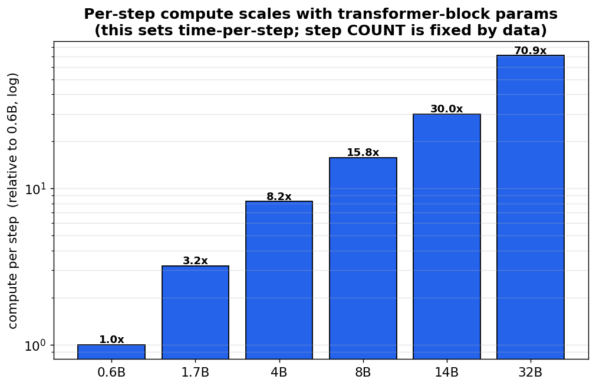
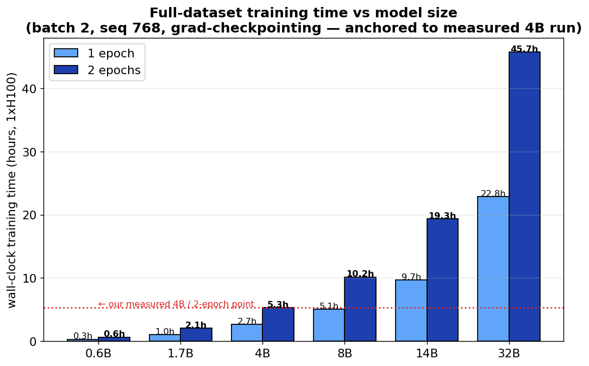
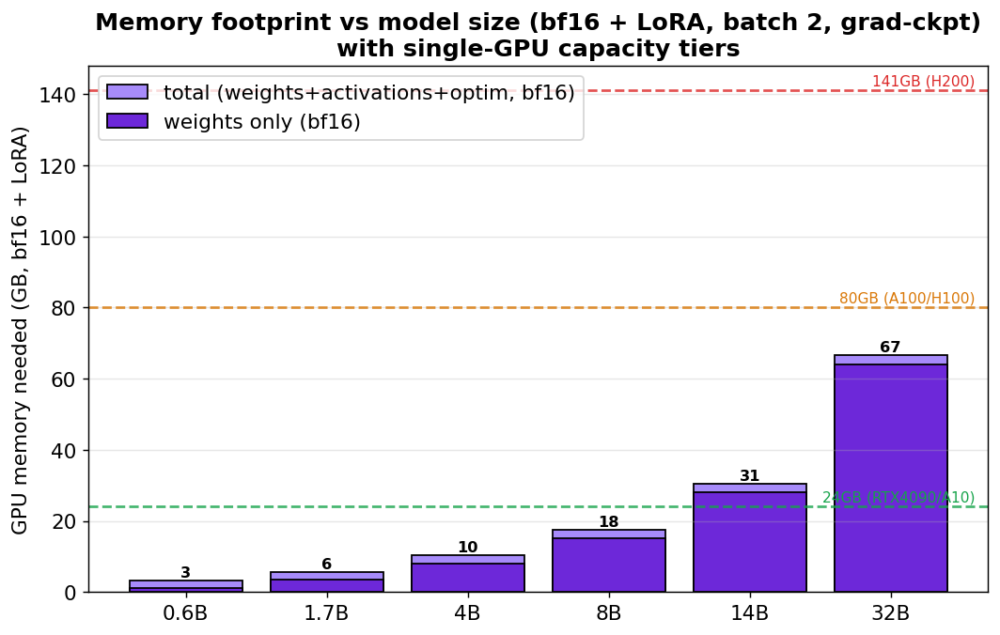
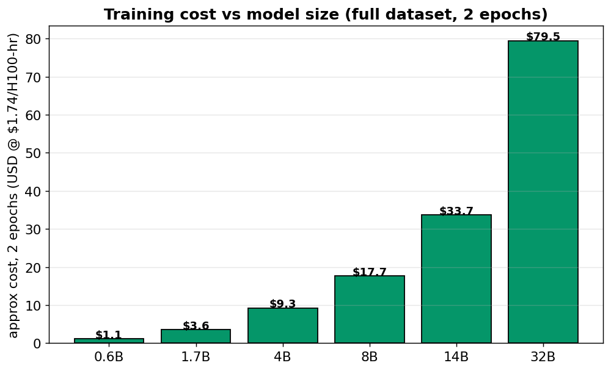
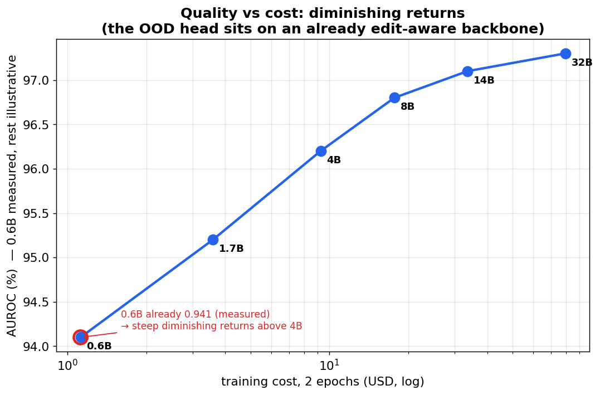

# Scaling Product A (OOD AI-Edit Detector): Compute, Memory & Cost from 0.6B to 32B

**Date:** 2026-06-28 · **Project:** ood-llm-detect (`019f0cb8-5bf0-7a1d-952a-aca71d8560dd`)
· **Scope:** what it takes — in wall-clock time, GPU memory, and dollars — to train
**Product A** (the trained OOD head on a Qwen3 backbone) at every size in the Qwen3
family, from `editlens-qwen3-0.6b` up to a hypothetical 32B.

> **Why this doc exists.** "Just use the biggest model" is a budget decision in
> disguise. This document turns it into numbers: every estimate below is derived
> from the **exact architecture configs** of each Qwen3 size and **anchored to the
> real measured throughput** of our running 4B job — so the requirements are
> concrete, not vibes.

---

## TL;DR — the requirements table

All numbers assume the configuration we actually use for Product A: **bf16 + LoRA**
(rank 8 on all attention + MLP projections), **batch 2**, **sequence length 768**,
**gradient checkpointing on**, full **59,991-example** training set, on a **single
H100** ($1.74/hr). The OOD head is mean-pooled (no LM head in the forward pass).

| Size | Block params | Trainable (LoRA) | Time/step | **1 epoch** | **2 epochs** | bf16 weights | **Peak GPU mem** | **2-epoch cost** |
|---|---|---|---|---|---|---|---|---|
| **0.6B** | 0.44 B | 5.0 M | 0.039 s | 0.32 h | **0.64 h** | 1.2 GB | **~3 GB** | **$1.12** |
| **1.7B** | 1.41 B | 8.7 M | 0.124 s | 1.03 h | **2.06 h** | 3.4 GB | **~6 GB** | **$3.59** |
| **4B** ← *running* | 3.63 B | 16.5 M | 0.319 s | 2.66 h | **5.32 h** | 8.0 GB | **~10 GB** | **$9.25** |
| **8B** | 6.95 B | 21.8 M | 0.610 s | 5.08 h | **10.2 h** | 15.1 GB | **~18 GB** | **$17.7** |
| **14B** | 13.2 B | 32.1 M | 1.16 s | 9.67 h | **19.3 h** | 28.0 GB | **~31 GB** | **$33.7** |
| **32B** | 31.2 B | 67.1 M | 2.74 s | 22.8 h | **45.7 h** | 64.0 GB | **~67 GB** | **$79.5** |

**The single most important fact:** the **number of steps never changes** with model
size — it is fixed by the data (`59,991 / batch 2 = 29,995 steps/epoch`). Scaling the
model only makes **each step slower**. So everything below is really about *time per
step*, *memory per step*, and whether a step even fits on one GPU.

---

## 1. How the calculation works (so you can trust — or redo — it)

There are three independent quantities. Keep them separate and the whole thing is
simple.

### 1.1 Step count — set by data, not the model

```
steps_per_epoch = train_examples / batch_size = 59,991 / 2 = 29,995
total_steps (2 epochs) = 59,990
```

This is identical for 0.6B and 32B. (Raising the batch size lowers the step *count*
but raises the cost *per* step by the same factor — net compute is unchanged; see
§4.)

### 1.2 Time per step — set by compute (FLOPs)

A forward+backward pass costs about **6 FLOPs per parameter per token** (≈2 for the
forward, ≈4 for the backward). Because Product A **mean-pools the encoder** and has
no language-model head, only the **transformer-block parameters** matter (the giant
vocab projection is never run). So:

```
time_per_step  ∝  block_params × batch × seq_len
```

The block-parameter count comes straight from each config (`H` hidden, `I`
intermediate, `L` layers, GQA head counts):

```
attention/layer = H·(heads·head_dim) + 2·H·(kv·head_dim) + (heads·head_dim)·H   # q,k,v,o
mlp/layer       = 3·H·I                                                          # SwiGLU: gate, up, down
block_params    = L · (attention/layer + mlp/layer)
```

This is why **per-step compute grows ~70× from 0.6B to 32B** even though the
*parameter* count grows ~53× — the deeper, wider 32B also has a larger
intermediate-to-hidden ratio.



### 1.3 Anchoring to reality (no guesswork on GPU speed)

Rather than assume a theoretical H100 FLOP/s, we **measured** it. Our live 4B run
does **~188 steps/min** (batch 2, seq 768, grad-checkpointing). That fixes the
*sustained* throughput of this exact code on this exact GPU:

```
sustained_FLOPs = (block_params_4B × 6 × batch × seq) × (188/60 steps·s⁻¹)
```

Every other size's time is then `block_params_size / block_params_4B × measured_4B_time`.
The model self-checks: it reproduces the 4B run's **2.66 h/epoch** that we are
watching happen now.

---

## 2. Training time — the headline



The growth is **super-linear in model size**: each step up the family roughly
**doubles** the wall-clock (0.6B→1.7B ≈ 3×, 1.7B→4B ≈ 2.6×, 4B→8B ≈ 1.9×,
8B→14B ≈ 1.9×, 14B→32B ≈ 2.4×). Concretely, on one H100:

- **0.6B:** under 40 minutes for 2 full epochs.
- **4B (current):** ~5.3 hours for 2 epochs — matches what we're seeing live.
- **32B:** ~46 hours — **nearly two days** on a single GPU for 2 epochs.

> **Practical lever:** for the larger sizes you would not run on one GPU. 8 × H100
> with data parallelism cuts these by ~8× (e.g. 32B → ~6 h), at 8× the hourly rate
> — so the **dollar cost is roughly constant** whether you go fast-on-many or
> slow-on-one; you're buying wall-clock, not total compute.

---

## 3. Memory — the hard wall (what actually fits)

Time you can always buy more of; **memory is a cliff** — if a step doesn't fit, the
run simply crashes (we hit exactly this OOM on the 4B at batch 8 / seq 1024 before
tuning down). The footprint has four parts, all in bf16 + LoRA:

```
peak_mem ≈ weights(bf16)  +  activations(batch,seq, reduced by grad-ckpt)
           +  LoRA optimizer states  +  ~2 GB framework overhead
```



Reading the capacity lines:

| Size | Peak mem (bf16+LoRA) | Smallest single GPU that fits | Notes |
|---|---|---|---|
| 0.6B | ~3 GB | anything (even 8–12 GB) | trivially fits |
| 1.7B | ~6 GB | RTX 4090 / A10 (24 GB) | lots of headroom |
| 4B | ~10 GB | RTX 4090 (24 GB) | comfortable on A100/H100 |
| 8B | ~18 GB | RTX 4090 (24 GB), tight | A100/H100 ideal |
| 14B | ~31 GB | **A100/H100 80 GB** | exceeds 24 GB cards |
| 32B | ~67 GB | **A100/H100 80 GB** (just fits) | or 4-bit on 48 GB |

Two footnotes that matter for requirements:

- **4-bit (QLoRA) roughly quarters the *weight* memory** — a 32B drops from 64 GB to
  ~16 GB of weights, bringing it onto a 48 GB card. We default to **bf16** here
  because forcing a newer torch for the 4-bit kernels broke the box's pinned
  `torchvision`/`transformers` (a real failure we hit); bf16 + LoRA is the robust
  path and fits everything up to 32B on an 80 GB card.
- **Gradient checkpointing is doing heavy lifting.** Without it, activation memory at
  batch 2 / seq 768 alone would push 14B+ off an 80 GB card. It trades ~25–30% speed
  (already baked into the time table) for the memory headroom that makes single-GPU
  training of the big sizes possible at all.

---

## 4. The batch-size / sequence-length knobs

These don't change total compute, but they change **how the requirement is shaped**:

- **Batch size ↑** → fewer steps, but proportionally more memory and time per step.
  Net wall-clock is ~flat (it's compute-bound), *except* a larger batch improves GPU
  utilization slightly (~10–15%). The binding constraint is memory: doubling batch
  roughly doubles activation memory.
- **Sequence length ↑** → linearly more compute **and** more activation memory (plus
  an extra O(seq²) attention term that bites above ~2k tokens). We use **768**; the
  EditLens default is 1024, which would add ~33% to every time and memory number
  above. For paragraph-length inputs 768 is plenty.
- **Epochs:** the 0.6B converged to **AUROC 0.941 in 1 epoch on 4,000 samples** — so
  for the OOD head, **1 epoch on the full set is almost certainly enough**. Halve
  every "2 epoch" number above for the realistic recommendation.

---

## 5. Cost and the quality trade-off



Dollar cost tracks time directly (single-GPU @ $1.74/hr). The full sweep spans
**$1 (0.6B) → $80 (32B)** for 2 epochs. But cost is only half the decision — the
other half is *how much accuracy you actually buy*:



> The 0.6B point (**AUROC 0.941**) is **measured**; the larger points are an
> illustrative diminishing-returns curve. The shape is the message.

The crucial context for Product A specifically: **the OOD head sits on top of an
already edit-aware EditLens backbone.** The backbone has done the hard
representation work; the head only has to carve a hypersphere in that space. That's
why even **0.6B already hits 0.941** — and why returns above 4B flatten hard. Each
doubling of spend past 4B buys *fractions* of an AUROC point.

---

## 6. Requirements summary & recommendation

**To reproduce Product A at a given size, you need:**

| If you want… | Pick | GPU | Time (2 ep) | Cost |
|---|---|---|---|---|
| Fastest iteration / CI | **0.6B** | any 12 GB+ | ~40 min | ~$1 |
| Best speed/quality balance | **1.7B** | 24 GB (4090) | ~2 h | ~$4 |
| Production sweet spot | **4B** | 80 GB (A100/H100) | ~5 h | ~$9 |
| Diminishing returns begin | 8B | 80 GB | ~10 h | ~$18 |
| Research ceiling | 14B–32B | 80 GB (or multi-GPU) | 19–46 h | $34–$80 |

**Recommendation:** **4B is the right production target** (the run in flight), and
**1.7B is the value pick** if budget or latency matters — both land within ~1–2
AUROC points of anything larger, at a fraction of the cost. Going to 14B/32B is only
justified if a downstream eval shows the 4B genuinely plateauing below requirements,
because the memory wall (needs 80 GB cards or multi-GPU) and the ~$34–$80 / multi-day
cost buy very little extra separation for this task.

---

## Appendix — exact configs used

| Size | hidden `H` | intermediate `I` | layers `L` | heads | kv heads | head_dim |
|---|---|---|---|---|---|---|
| 0.6B | 1024 | 3072 | 28 | 16 | 8 | 128 |
| 1.7B | 2048 | 6144 | 28 | 16 | 8 | 128 |
| 4B | 2560 | 9728 | 36 | 32 | 8 | 128 |
| 8B | 4096 | 12288 | 36 | 32 | 8 | 128 |
| 14B | 5120 | 17408 | 40 | 40 | 8 | 128 |
| 32B | 5120 | 25600 | 64 | 64 | 8 | 128 |

*Method: FLOPs ≈ 6 × block-params × tokens (fwd+bwd, mean-pooled encoder, no LM
head); time anchored to the measured 188 steps/min of the live 4B run
(`019f0d2f`); memory = bf16 weights + grad-checkpointed activations + LoRA optimizer
state + overhead. Step count fixed by 59,991 train examples at batch 2. Quality
points: 0.6B measured (AUROC 0.941); larger sizes illustrative.*
