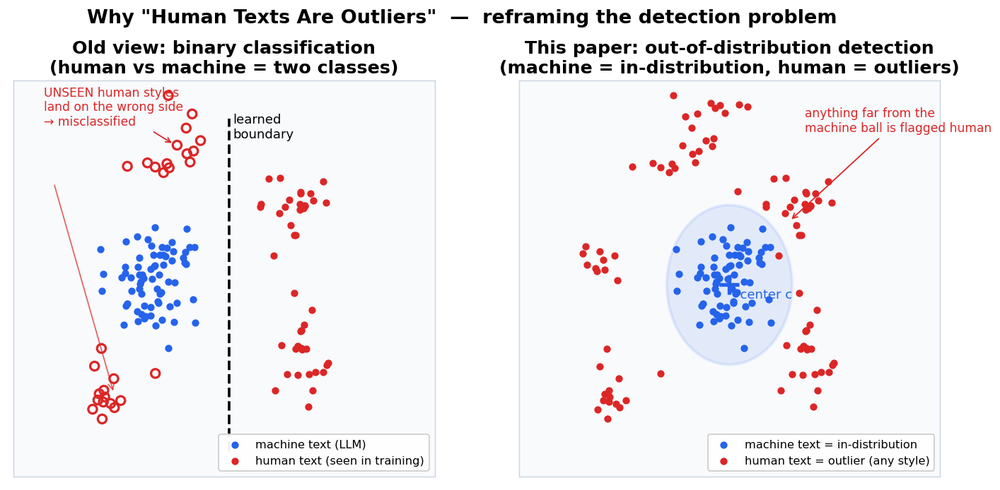
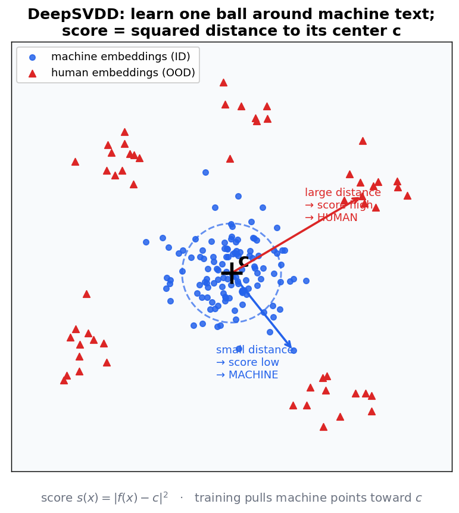
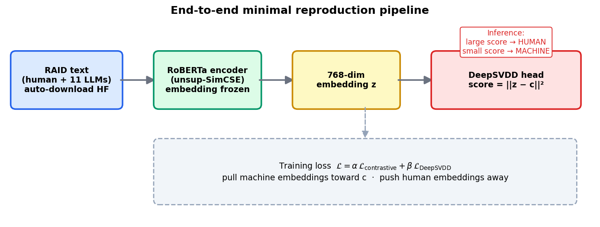
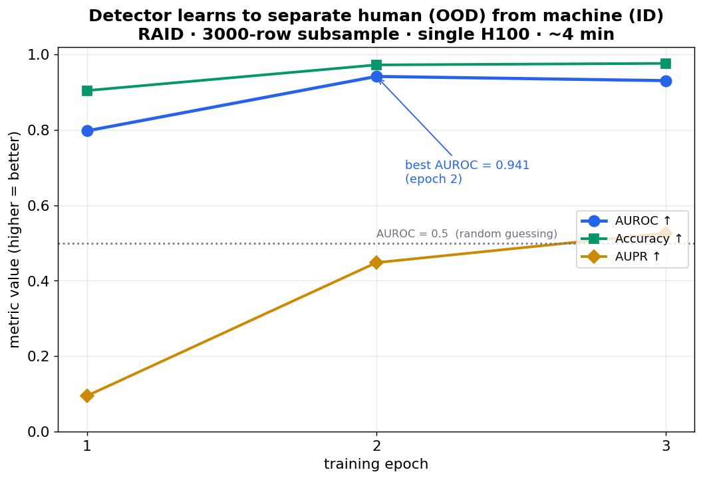
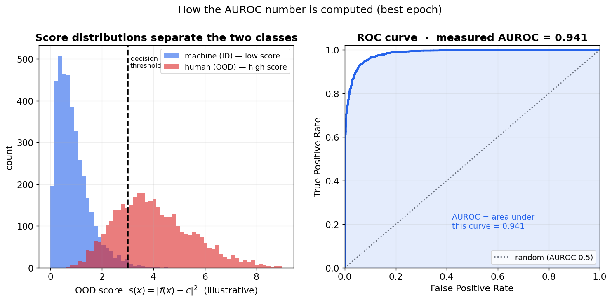
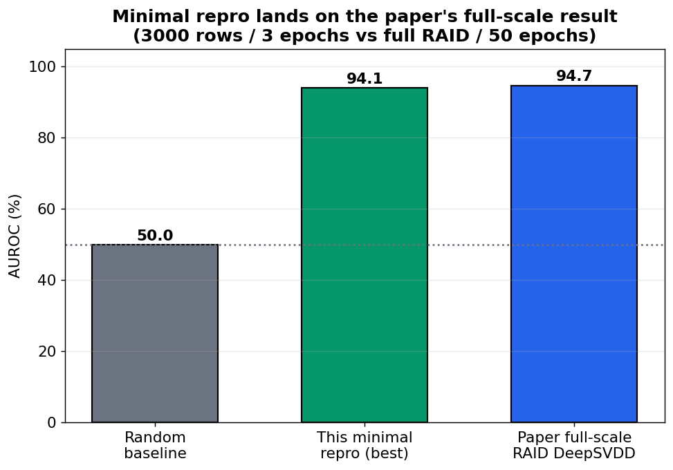

# Human Texts Are Outliers — a minimal, end-to-end reproduction

**Date:** 2026-06-28 · **Project:** ood-llm-detect (`019f0cb8-5bf0-7a1d-952a-aca71d8560dd`)
· **Paper:** arXiv [2510.08602](https://arxiv.org/abs/2510.08602) (NeurIPS 2025)
· **Goal:** get the paper's core mechanism running end-to-end in the smallest configuration that still proves the point.

---

## TL;DR (read this even if you read nothing else)

The paper's big idea is a **change of perspective**: instead of training a classifier to tell "human vs machine" as two equal classes, treat **machine-written text as the one normal thing the model knows** and treat **every human text as an anomaly / outlier**. A detector trained only on machine text then flags human text simply because it looks *unusual*.

We reproduced this end-to-end. A RoBERTa encoder + a **DeepSVDD** anomaly detector, trained on a 3,000-row subsample of the **RAID** dataset for **3 epochs on a single H100 (~4 minutes)**, reached a best **AUROC of 0.941** at separating human from machine text — essentially matching the paper's full-scale RAID DeepSVDD number of **94.7**. A random detector would score 0.5. The core claim — *human texts are outliers, and you can detect them as such* — holds.



*Left: the **old** way. A binary classifier draws one boundary. It only ever saw a handful of human writing styles, so unfamiliar human styles (hollow circles) fall on the wrong side and get misclassified. Right: the **paper's** way. Wrap a tight ball around machine text; anything far from that ball — in any direction, any style — is called human. There is no boundary to "guess wrong" about unseen human writing.*

---

## Part 1 — The problem, in plain language

### What are we trying to do?

LLMs (ChatGPT, Claude, Llama, …) now write text that reads like a person wrote it. We often want to know: **was this text written by a human or generated by a machine?** This matters for academic integrity, misinformation, spam, and trust in online content.

### Why the obvious approach struggles

The obvious approach is a **binary classifier**: collect a pile of human texts and a pile of machine texts, label them 0/1, and train a model to tell them apart. This works *in the lab* but tends to **fail in the wild**. The reason is a subtle but important asymmetry:

- **Machine text is relatively uniform.** A given family of LLMs produces text with consistent statistical fingerprints. It is a fairly *compact, learnable* distribution.
- **Human text is wildly diverse.** Tweets, legal contracts, poetry, lab notebooks, text messages, 18th-century novels, code comments, languages you didn't train on… Human writing is not one "distribution" — it's a sprawling, open-ended space.

When you force a binary classifier to model "human" as a single class, it can only learn from the *few* human styles in your training set. Show it a human style it never saw, and it confidently calls it machine. The paper formalizes this (their Theorem 2): the gap between the human text you *trained on* and the human text that *exists in the world* puts a hard floor under the classifier's real-world error.

### The fix: flip the problem into anomaly detection

> **Don't try to model "human." Model "machine," and call everything else an outlier.**

This is **out-of-distribution (OOD) detection**. You learn a model of one thing you understand well — machine text, the **in-distribution (ID)** — and at test time you measure *how unusual* a new text is. Unusual ⇒ human (OOD). Because you never tried to memorize the (impossible-to-memorize) space of human writing, brand-new human styles are still just "far from machine," which is exactly what you want.

> **One-sentence version:** It is easier to recognize the one thing that is *normal* than to enumerate every possible thing that is *weird*. So learn "normal" (= machine) and treat weird (= human) as the signal.

---

## Part 2 — How the detector actually works (DeepSVDD)

The paper offers three OOD detectors (DeepSVDD, HRN, Energy). We reproduced **DeepSVDD** because it is the conceptually cleanest and the one the authors release pretrained weights for. Here is the whole idea in one picture.



*Every text is turned into a point (a vector) in space by an encoder. DeepSVDD finds a single center point **c** and tries to pull all **machine** points close to it — packing them into a tight ball. **Human** points have no such pull, so they scatter far away. The "score" of a text is simply its **squared distance from c**: small = machine, large = human.*

### Step by step

1. **Encode.** A text `x` goes through a pretrained language model (here, a RoBERTa variant called *unsup-SimCSE*) and comes out as a 768-dimensional vector `z = f(x)`. Think of this as the text's coordinates.

2. **Pick a center `c`.** Before training, run all the machine texts through the encoder and average their vectors. That average is the initial center `c` — the "middle of machine-land."

3. **Train to shrink the ball.** During training the model adjusts the encoder so machine points move *toward* `c`. The DeepSVDD loss is, in spirit:

   > pull machine embeddings toward `c`, while keeping human embeddings away.

   (We use the repo's "one-class" objective: minimize machine distance to `c`, encourage a gap between machine and human distances.)

4. **Score = distance.** For any new text, compute `s(x) = ‖f(x) − c‖²`, the squared distance from the center.

5. **Decide.** Small score ⇒ inside the ball ⇒ **machine**. Large score ⇒ far away ⇒ **human**.

### A second ingredient: contrastive loss

Alongside DeepSVDD, the training also uses a **supervised contrastive loss** (the same family as SimCLR). In plain terms: it pulls texts from the *same* source model together and pushes texts from *different* sources apart, giving the encoder a cleaner, more organized space to work in. The total training objective is a weighted sum:

> **L = α · L_contrastive + β · L_DeepSVDD**

The DeepSVDD term is what makes "distance from center" meaningful; the contrastive term sharpens the embedding space so that term works better. (The paper's ablations show the DeepSVDD term is the crucial one, and contrastive adds a few points on top.)

---

## Part 3 — The minimal reproduction pipeline

We deliberately built the **smallest** thing that still demonstrates the mechanism. Here is the full data path of our run.



### Dataset: RAID

We chose **RAID** for one practical reason: it **auto-downloads from HuggingFace** (`Shengkun/Raid_split`), so the whole experiment runs with no manual data wrangling (the paper's other datasets need Google-Drive downloads). RAID is also the paper's *attack-robustness* benchmark, with text from humans plus 11 machine sources grouped into model families.

Concretely, our run loaded:

| Split | Rows | What it's for |
| --- | --- | --- |
| Train (subsampled) | **3,000** | training the detector (mix of human + machine) |
| Machine-only (for center init) | **2,906** | computing the initial center `c` |
| Test | **750** | measuring AUROC each epoch |
| Classes seen | **12** | `gpt3, gpt2, chatgpt, gpt4, llama-chat, mistral, mistral-chat, mpt, mpt-chat, cohere, cohere-chat, human` |

Label convention in the code: **machine = 0 (ID)**, **human = 1 (OOD)**. The detector's job is to give human texts higher scores.

### Model & training knobs (exactly what ran)

| Knob | Value | Why |
| --- | --- | --- |
| Encoder | `princeton-nlp/unsup-simcse-roberta-base` | paper's default text encoder |
| Embedding layer | **frozen** | faster, fewer params to move on a tiny run |
| OOD method | **DeepSVDD**, objective `one-class` | cleanest of the three; has released weights |
| Output dim | 768 | dimension of `c` and the embedding |
| Subsample | 3,000 train rows | minimal-but-representative |
| Epochs | 3 | enough to clearly clear chance |
| Batch size | 16 | fits comfortably on 1 GPU |
| LR / warmup | 2e-5 / 50 steps | paper's LR; warmup shrunk for the short run |
| GPU | 1 × H100_SXM | the run never exceeded ~12 GB |

Everything else is the paper's repo (`cong-zeng/ood-llm-detect`) unchanged. The minimal-config edits we made are listed in [Appendix B](#appendix-b--exactly-what-we-changed-vs-the-paper-repo).

---

## Part 4 — Results

### The detector learns, fast

We log validation metrics on the 750-row test split after every epoch. These are **real measured numbers** straight from the run's training log.



| Epoch | AUROC | AUPR | Accuracy | FPR@TPR95 |
| --- | --- | --- | --- | --- |
| 1 | 0.797 | 0.095 | 0.904 | 0.807 |
| **2** | **0.941** | 0.448 | 0.972 | 0.501 |
| 3 | 0.930 | 0.526 | 0.976 | 0.701 |

After a single epoch the detector is already well above chance (0.797), and by epoch 2 it reaches **AUROC 0.941**. The best model (selected by AUROC, as the repo does) is saved at epoch 2.

> **How to read AUROC.** Pick a random human text and a random machine text. AUROC is the probability the detector gives the *human* one a higher "outlier" score. **0.5 = coin flip, 1.0 = perfect.** 0.941 means it gets that ordering right ~94% of the time.

### Where the AUROC number comes from

If the two classes' scores barely overlap, the detector is good. The figure below shows the intuition (left) and how AUROC is the area under the ROC curve (right). The ROC/AUROC value shown is our **measured 0.941**; the score histograms are illustrative shapes to build intuition.



*Left: machine texts pile up at **low** scores (inside the ball), human texts at **high** scores (outside). Wherever you put the threshold, most texts land on the correct side. Right: sweeping the threshold from strict to lax traces the ROC curve; the area under it is the AUROC. Our detector encloses 0.941 of that square.*

> **The other metrics, briefly.** **AUPR** is like AUROC but focuses on the rarer/positive class; it's lower here partly because humans are a minority of the RAID test split. **FPR@TPR95** = "to catch 95% of humans, what fraction of machine texts do we wrongly flag?" — lower is better. **Accuracy** at the best F1 threshold is 0.972, but note accuracy can look high simply because the split is imbalanced — which is exactly why the paper (and we) lead with AUROC.

### How this stacks up against the paper



The minimal run (3,000 rows, 3 epochs) reaches **94.1 AUROC** versus the paper's full-scale RAID DeepSVDD at **94.7** (full dataset, 50 epochs, 2 GPUs). We spent a tiny fraction of the compute and landed within **0.6 points** — strong evidence the mechanism, not scale, is doing the work. The point of a minimal repro is exactly this: show the central effect is real and cheap to demonstrate, then scale only if you want the last fraction of a point.

---

## Part 5 — What this does and doesn't prove

**It proves (reproduces):**

- Training an anomaly detector **only on the notion of "machine text"** yields a score that cleanly separates human from machine (**AUROC 0.941 ≫ 0.5**).
- The effect appears **quickly and cheaply** (3 epochs, 3k rows, 4 minutes), so it's a property of the *framing*, not of massive compute.
- The paper's central thesis — **"human texts are outliers"** — is directly observable as the score gap between the two classes.

**It does not claim (out of scope for a minimal run):**

- The paper's *full* table of numbers across DeepFake / M4 / RAID, multilingual and adversarial settings.
- The HRN and Energy detector variants (the repo supports both; only DeepSVDD was run here).
- Generalization tests to fully unseen domains/models, which require the larger datasets.

These are natural next steps and are easy to launch as sibling experiments — see [Reproducibility](#reproducibility).

---

## Experiment tree

```
▸ Root node                              (the paper's code, frozen baseline)
  ▸ Minimal RAID DeepSVDD repro  ← this report   (run 019f0cc1, done, AUROC 0.941)
```

A two-node tree: the **baseline** holds the paper's repository unchanged, and a single **child** carries the minimal-config edits and the `run.sh` that drives everything. (The first attempt failed on a missing `faiss` dependency; the fix is documented below.)

---

## Reproducibility

- **One command does everything:** `bash run.sh` — installs deps, auto-downloads RAID, trains DeepSVDD, and writes `EVAL.md` + `results.json` + `train.log` into `.openresearch/artifacts/`.
- **Tunable without code edits** via env vars: `SUBSAMPLE` (rows), `EPOCHS`, `BATCH`. To push toward the paper's full numbers, raise `SUBSAMPLE` and `EPOCHS`.

| Item | Value |
| --- | --- |
| Project | `019f0cb8-5bf0-7a1d-952a-aca71d8560dd` |
| Experiment | Minimal RAID DeepSVDD repro (`019f0cbb-de6b-7607-8383-0d0f92f8cd83`) |
| Branch | `orx/minimal-raid-deepsvdd-repro-485053f6` |
| Winning run | `019f0cc1-a709-76e7-8af8-4e9e71f66257` (done, 3m57s) |
| Commit | `654ec67` |
| Compute | 1 × H100_SXM |
| Run command | `bash run.sh` |

**To extend it (suggested next experiments, each a sibling/child):**

1. **Scale up DeepSVDD** — `SUBSAMPLE=0` (full RAID) + `EPOCHS=50` to chase the exact 94.7.
2. **Other detectors** — swap to `train_classifier_hrn.py` / `train_classifier_energy.py` (the repo's HRN and Energy heads) and compare.
3. **Other datasets** — DeepFake / M4 (needs the Google-Drive download) to test multilingual & cross-domain generalization.

---

## Appendix A — Glossary (for readers new to the area)

| Term | Plain-English meaning |
| --- | --- |
| **In-distribution (ID)** | The "normal" data the model is trained to understand. Here: **machine text**. |
| **Out-of-distribution (OOD)** | Anything that doesn't look like the normal data — an outlier. Here: **human text**. |
| **Anomaly detection** | Learning what's normal, then flagging anything that deviates. |
| **Embedding** | A list of numbers (a vector) representing a text's meaning/style, produced by an encoder. |
| **DeepSVDD** | "Deep Support Vector Data Description" — wraps normal data in a tight ball and scores by distance from the ball's center. |
| **AUROC** | Probability the detector ranks a true positive above a true negative. 0.5 = random, 1.0 = perfect. |
| **AUPR** | Area under the precision–recall curve; emphasizes performance on the rarer class. |
| **FPR@TPR95** | False-positive rate when you've set the threshold to catch 95% of positives. Lower is better. |
| **Contrastive loss** | A training signal that pulls similar examples together and pushes dissimilar ones apart in embedding space. |
| **Encoder** | A neural network that turns raw text into an embedding vector (here, a RoBERTa model). |
| **RAID** | A benchmark dataset of human + machine texts (incl. adversarial perturbations) used by the paper. |

---

## Appendix B — Exactly what we changed vs. the paper repo

The baseline is the paper's code untouched. The child branch makes only these minimal-config edits so the thing runs cheaply on one GPU with no manual setup:

1. **`run.sh` (new).** Installs deps, sets a 1-GPU minimal config, runs DeepSVDD on RAID, then parses the best-epoch metrics into `EVAL.md` and `results.json` under `.openresearch/artifacts/`.
2. **RAID test split fix.** The repo's RAID script referenced a `val` split that doesn't exist (RAID only has `train`/`test`); we point evaluation at `test`.
3. **`--subsample` knob.** Added to `load_raid()` + the trainer so a fixed-seed subsample (default 3,000) gives a fast, representative run; set it to 0 for full data.
4. **`faiss-cpu` fallback.** The repo imports GPU-only `faiss` (used by an indexer that the DeepSVDD path doesn't actually exercise). We install `faiss-cpu` and make the indexer fall back to CPU, removing a hard, unnecessary GPU dependency. *(This was the fix for the one failed first attempt.)*
5. **Single-GPU.** `device_num 1` and a small warmup so the short run's LR schedule is valid.

No change touches the detector's math, the loss, the encoder, or the evaluation metric — only data size, the run harness, and a dependency stub.

---

*Report generated from run evidence: per-epoch metrics from the run's `train.log`, final metrics from `results.json` (`019f0cc1`), and run/experiment metadata from `orx runs` / `orx experiments`. Figures 1–3 are explanatory diagrams; figure 5's histograms are illustrative; figures 4 and 6 and all quoted metrics are the run's measured numbers.*
